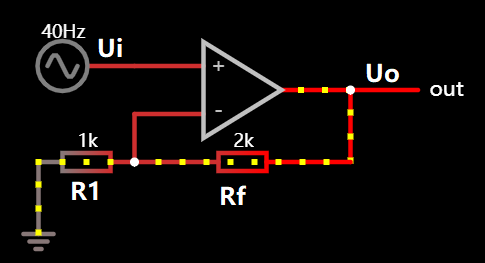
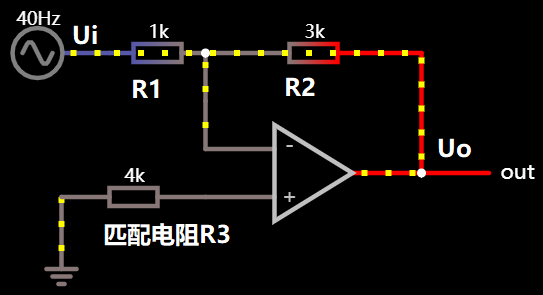
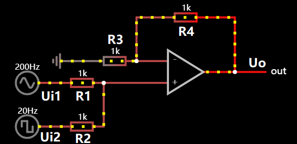
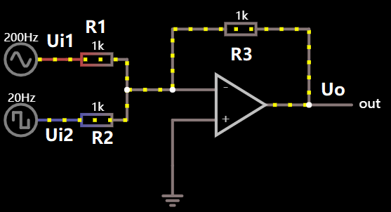
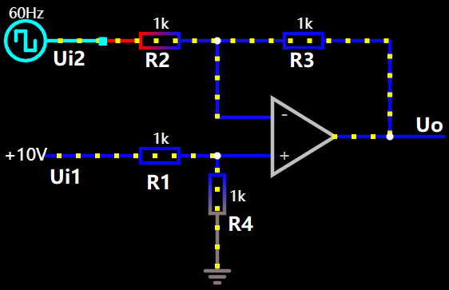
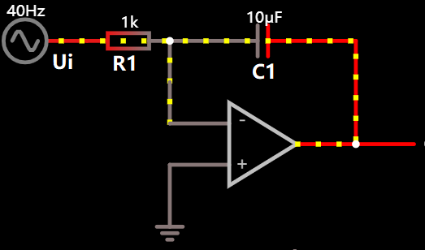
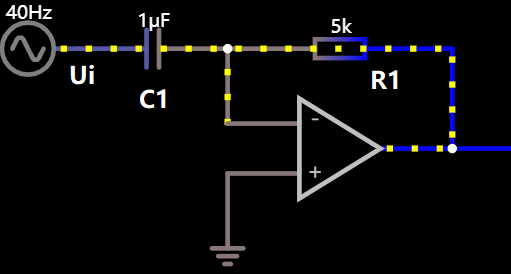
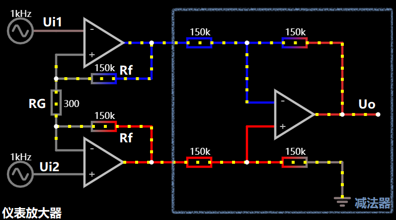

## 基本计算原则

* U+ = U\_ = Ui

* I+ = I\_ =0

## 同相比例放大器

* (0- U\_)/R1 = (U\_ - Uo)/Rf

* Uo=（1+Rf/R1)Ui

## 反相比例放大器

* Uo=-（R2/R1）Ui

  ## 加法器

  

* 叠加

* Uo=\[ (1+R4/R3) / (R1+R2) \] ((R2\*Ui1) +(R1\*UI2))

  

  ## 减法器

  

* 叠加

* Uo=（R2+R3/R2) \* (R4/R1+R4) \* Ui1  -  (R3/R2)\*Ui2

## 积分器

* Uo=-Uc=-q/C =-(∫idt /C)

* i=Ui/R

* => Uo=-1/RC ∫Ui dt

* ( 例外：差动积分)

# 微分器

##  仪表放大器

* Ui2-Ui1= I \*(2RF+RG)

* I=(Ui2-Ui1)/RG

* Uo=(1+2RF/RG)(Ui2-Ui1)